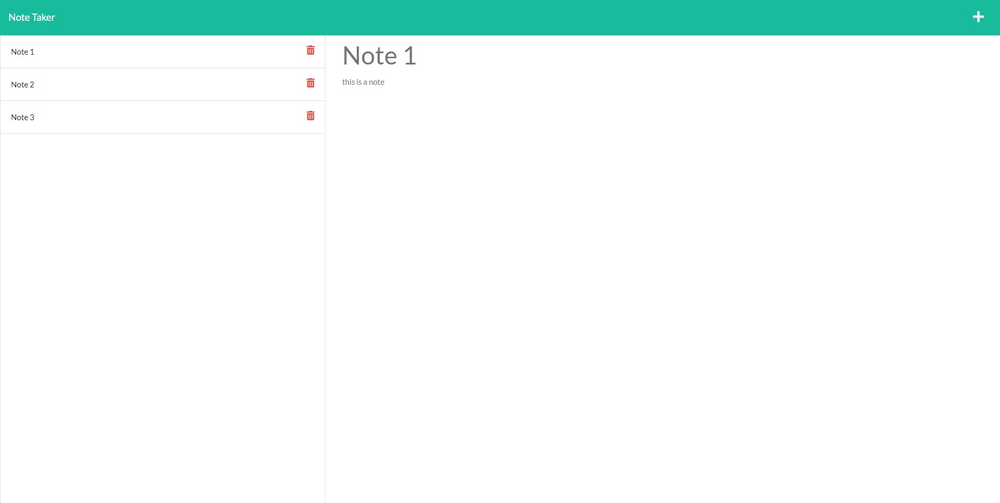

# Note-Taker

## Screenshot Of Project

## Description

An app that uses a server in order to store notes that a user inputs. The db.json file fills the role of a database that receives the notes. Users can delete previously added notes too.
My motivation for creating this was to learn more about requests and servers, as well as learning how to use heroku.

## Installation

1: Download repo from github. 2: Save where desired. 3: Open file with a text editor of your choice

For accessing the website rather than the code follow these instructions:

1: Copy link provided in this README

## Usage

Before using ensure that you have node installed.

If running on localhost follow these instructions:

1: Open your integrated terminal in your text editor. 2: type node server, it should run on port 8080. 3: in your browser type in "localhost:8080" this will take you to the homepage. 4: Click "Get started". 5: You can add a new note by clicking the plus, then typing your note on the right, and then clicking the floppy disk icon. 6: To delete, just click on the red bin icon.

If running on heroku click the link provided at the start of this README, then start the above instructions at step 4.

## License

MIT License

Copyright (c) [2021] [Matthew Walford]

Permission is hereby granted, free of charge, to any person obtaining a copy of this software and associated documentation files (the "Software"), to deal in the Software without restriction, including without limitation the rights to use, copy, modify, merge, publish, distribute, sublicense, and/or sell copies of the Software, and to permit persons to whom the Software is furnished to do so, subject to the following conditions:

The above copyright notice and this permission notice shall be included in all copies or substantial portions of the Software.

THE SOFTWARE IS PROVIDED "AS IS", WITHOUT WARRANTY OF ANY KIND, EXPRESS OR IMPLIED, INCLUDING BUT NOT LIMITED TO THE WARRANTIES OF MERCHANTABILITY, FITNESS FOR A PARTICULAR PURPOSE AND NONINFRINGEMENT. IN NO EVENT SHALL THE AUTHORS OR COPYRIGHT HOLDERS BE LIABLE FOR ANY CLAIM, DAMAGES OR OTHER LIABILITY, WHETHER IN AN ACTION OF CONTRACT, TORT OR OTHERWISE, ARISING FROM, OUT OF OR IN CONNECTION WITH THE SOFTWARE OR THE USE OR OTHER DEALINGS IN THE SOFTWARE.